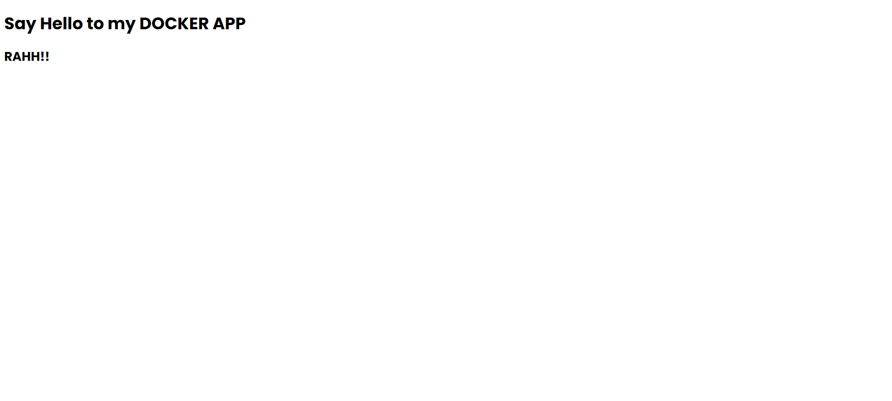

# Docker First Steps
#### 10/08/2024

## Aim:
    > to setup a docker container to run a simple web page

## Progress:
- used Docker Desktop app (for windows) which comes with Docker engine and DockerCLI
- The app was setup using node.js and the express library
- The docker image uses node base image
- check [dockerfile](./dockerfile) for more details
- also check the [Google Doc](https://shorturl.at/492qu) file with eXtra details, on the contents of the dockerfile and the CLI commands
---
---

## How to?
>_for windows users: make sure `Docker Desktop/ Docker Engine` is running_
1. Building the docker image

    `docker build -t ffs ./dockerfile`

    > -t flag is for giving name to the dockerimage

    _nb: the command is relative to this readme_

2. Running the container

    `docker run -it -p 6869:6336 ffs`

    > -i and -t (used here as -it) keeps the STDIN open and allows us to interact with it... respectively

    > -p allows us to map the ports (the container one to externally accessible one)

3. verifying

    open `http://localhost:6869` to view the webpage

    
    ##### _the screenshot_
4. more steps

    use `docker inspect ffs` to know more information about the image `ffs`. 

    use `docker ps` to view all the running containers/ also can use the Docker Desktop app for the same

    use `docker container stop <container-name>` to stop the said container gracefully

    use `docker container stop <container-name>` to kick the container to the curb (aka stop mercilessly)

    use `docker container remove <container-name>` to remove/delete the container

    use `docker container restart <container-name>` to restart the said container

    > here `<container-id>` can also be used instead of `<container-name>`

